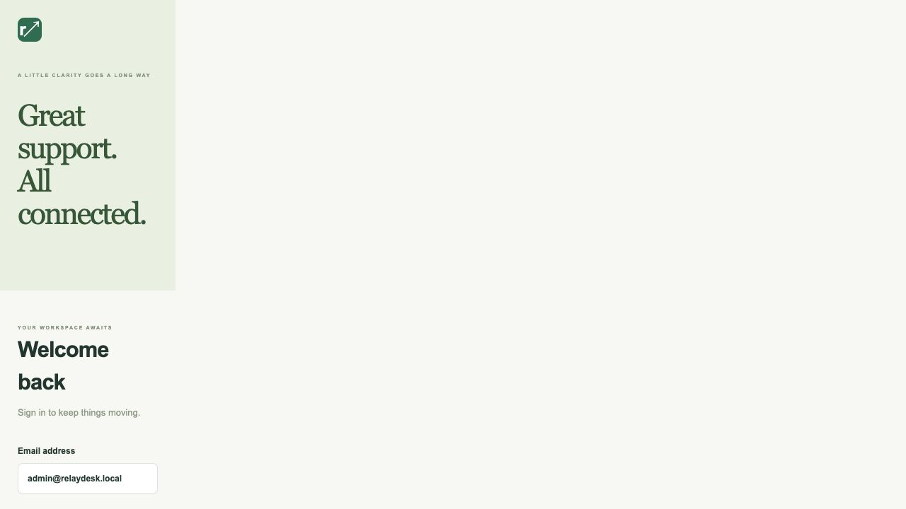

# RelayDesk

A small customer request desk with a calm, responsive workspace. Customers submit requests and evidence, agents move work through a clear workflow, and administrators connect external tools through signed webhooks.

Built as a complete portfolio monorepo: **Next.js + React + TypeScript + Tailwind + TanStack Query**, **FastAPI + SQLAlchemy 2 + Alembic + Pydantic v2**, **PostgreSQL + Redis**, Docker Compose, pytest, Vitest and GitHub Actions.

**Demo:** [Open the live RelayDesk frontend](https://harbordesk.majewski-web-audit.workers.dev) *(FE-only deployment; the API is not included in this public demo.)*


## Run the demo

Requires Docker Desktop (running), or Docker Engine with the Compose plugin.

```sh
docker compose up --build -d --wait
```

Open [RelayDesk](http://localhost:3000) and [interactive API documentation](http://localhost:8000/docs). Startup applies migrations and idempotently seeds demo users, three requests and a local webhook subscription. No external services or API keys are needed. Ports are bound to localhost.

If these ports are already occupied, use a separate pair (and retain the same variables for subsequent Compose commands):

```sh
API_PORT=8100 WEB_PORT=3100 NEXT_PUBLIC_API_URL=http://localhost:8100 CORS_ORIGINS=http://localhost:3100 docker compose up --build -d --wait
API_URL=http://localhost:8100 python3 scripts/smoke.py
```

All demo users use password **`RelayDesk123!`**:

- `admin@relaydesk.local`: all requests, team management, subscriptions and delivery activity.
- `agent@relaydesk.local`: all requests, editing and status changes.
- `customer@relaydesk.local`: own requests and attachments only.

The login screen includes role shortcuts. To validate the complete flow:

```sh
python3 scripts/smoke.py
```

The script performs real HTTP login, request creation, upload/download, agent status change and waits for a **successful HMAC-verified webhook**. It leaves the request and delivery as demo evidence. You can also perform the flow in the UI, then open **Webhooks → Delivery activity** as the admin.

```sh
docker compose logs -f api worker webhook-sink
docker compose down        # retain requests and uploads
# Destructive reset, only when you want to discard demo data:
# docker compose down -v
```

## Product decisions and permissions

- An authenticated customer portal satisfies the brief's public-form **or** portal option. Admins provision accounts; public registration is outside the MVP.
- Workflow: **new → in_progress → done / rejected**. Only agents and admins change status; terminal states do not reopen.
- Customers can edit/delete their own requests while new. Staff can edit/delete any request. Unauthorized request and attachment reads return 404 to avoid exposing another customer's records.
- Each request belongs to its creator. The queue returns the latest 200 requests; status and client-side text filters help triage.
- Files are local-volume storage with generated keys, authorized download, safe download names, extension/MIME/content checks, a 5 MiB per-file limit, and PDF, PNG, JPEG, UTF-8 text support. No public file URLs. Downloads use attachment disposition and `nosniff`.
- JWTs expire after eight hours and live in browser session storage. Passwords use Argon2. API permissions read the current database role on every request; changing a role takes effect without waiting for token expiry. Admins cannot demote themselves.
- Subscriptions may be added and disabled. Signing secrets are accepted on creation and never returned by the API. Delivery activity shows the latest 100 records and refreshes every three seconds.
- Status changes and delivery records commit in the **same transaction**. Redis Pub/Sub provides wakeup hints; the database outbox is the durable source of truth and is polled even if Redis is unavailable.
- A separate worker signs and sends events, records HTTP outcomes, and retries once after five seconds. PostgreSQL row locks with `SKIP LOCKED` prevent simultaneous normal processing by multiple workers. Disabling a subscription cancels queued delivery.
- Delivery is **at least once** under process crashes: a crash after the receiver accepts but before the DB commit can cause another attempt. Receivers should deduplicate using the payload event `id` (or `X-RelayDesk-Delivery`). The retry uses identical payload bytes.

## Architecture

```text
Browser (Next.js / React / TanStack Query)
  └─ JWT bearer API calls → FastAPI
      ├─ SQLAlchemy → PostgreSQL (users, requests, attachments, subscriptions, outbox)
      ├─ authorized file access → uploads volume
      └─ Redis notification → webhook worker
                                ├─ polls durable PostgreSQL outbox
                                └─ HMAC HTTP POST → configured receiver
```

- `apps/api/app`: API, authorization, models, seed, webhook worker.
- `apps/api/alembic`: versioned database migrations.
- `apps/api/tests`: workflow, authorization, upload validation and webhook retry tests.
- `apps/web`: responsive portal, request details, attachment management, team and webhook screens.
- `scripts/webhook_sink.py`: local demo HMAC receiver; accessible only within Compose.
- `scripts/smoke.py`: real HTTP acceptance check.
- `.github/workflows/ci.yml`: API/migration tests, frontend test/build/typecheck and full Compose smoke.

## Webhook contract

Event: `request.status_changed`. JSON contains `id`, `event`, `created_at`, and `data` with `request_id`, `previous_status`, `status`.

`X-RelayDesk-Signature: sha256=<hex HMAC-SHA256(secret, raw request bytes)>`

Verify the exact bytes using a constant-time comparison. Return a 2xx response within five seconds. Non-2xx responses, connection errors and timeouts trigger one scheduled retry. Redirects are not followed. The example receiver verifies signatures and returns 204; it stores no customer data. Demo signing secret: `demo-webhook-secret-change-me`.

## Configuration

Defaults allow the one-command local demo; copying `.env.example` to `.env` is optional. Compose reads the root `.env`.

- `POSTGRES_USER`, `POSTGRES_PASSWORD`, `POSTGRES_DB`: PostgreSQL connection parameters.
- `JWT_SECRET`: token signing key; use a strong random value for deployment.
- `NEXT_PUBLIC_API_URL`: browser-visible API URL, embedded at frontend **build time**. Rebuild the web image when it changes.
- `CORS_ORIGINS`: comma-separated explicit web origins; default `http://localhost:3000`.
- `API_PORT`, `WEB_PORT`: host port bindings; defaults 8000 and 3000. Update the browser API URL and CORS origin when changing these.
- `WEBHOOK_ALLOW_PRIVATE`: `true` in the local Compose demo so the internal receiver is reachable. API default outside Compose is `false`, requiring HTTPS and globally routable resolved addresses.
- `DATABASE_URL`: API SQLAlchemy URL. Compose supplies PostgreSQL; standalone development defaults to SQLite.
- `REDIS_URL`: notification/health Redis endpoint.
- `UPLOAD_DIR`: storage path; Compose uses persistent `/data/uploads`.
- `MAX_UPLOAD_BYTES`: API file cap, default 5242880 bytes. The demo UI describes this default.

For external deployment, remove demo seeding/accounts, rotate all demo credentials/secrets, enable HTTPS, restrict CORS, disable private webhook destinations and enforce network egress restrictions. DNS validation is not a replacement for an outbound firewall against DNS rebinding. Add reverse-proxy request size limits/rate limiting and backup the database and upload volume. The MVP does not include password reset, antivirus scanning, distributed login throttling or a production secret manager.

## Local development and tests

Python 3.12+ and Node 22+ are recommended. The API test suite uses isolated temporary SQLite storage, so it requires no database service. Runtime acceptance uses PostgreSQL in Compose.

```sh
cd apps/api
uv venv --python 3.12
uv pip install --python .venv/bin/python -r requirements.txt
.venv/bin/python -m pytest -q
.venv/bin/alembic upgrade head
.venv/bin/python -m app.seed
# SQLite demo, private webhook receiver enabled explicitly:
WEBHOOK_ALLOW_PRIVATE=true .venv/bin/uvicorn app.main:app --reload
```

For a complete non-Compose runtime, supply PostgreSQL and Redis, set `DATABASE_URL`/`REDIS_URL`, run `python -m app.webhooks`, and configure a reachable webhook receiver. `/health` checks both the database and Redis and returns 503 if Redis is absent. API test delivery HTTP calls are mocked; the Compose smoke uses the real receiver.

```sh
cd apps/web
npm ci
npm run dev
npm test
npm run build
npm run typecheck
```

Frontend test covers login → create request → upload attachment → agent status change with a mocked API and asserts the request payloads and authorization headers. API tests cover successful signed delivery, failed delivery with exactly one retry, retry recovery, subscription cancellation, tenant isolation, role changes and upload limits. CI additionally runs migrations up/down/up and full Compose acceptance.

## Screenshots

The HarborDesk visual pass gallery is available in [docs/ui-harbordesk](docs/ui-harbordesk/README.md). It shows the sky/blue support inbox, request detail, empty/loading states, composer, and mobile layout. The pass changes presentation only; the existing request model does not include functional unread, SLA, priority, or reply fields.

The captured login screen is available below. Additional portfolio screenshot slots are listed for the running demo:



- `docs/screenshots/login.png`: role shortcuts and sign-in.
- `docs/screenshots/requests.png`: queue, status filters and request statistics.
- `docs/screenshots/request-detail.png`: request workflow and attachments.
- `docs/screenshots/webhooks.png`: subscriptions and successful delivery activity.

Scope excludes payments, a mobile app, and Kubernetes.
