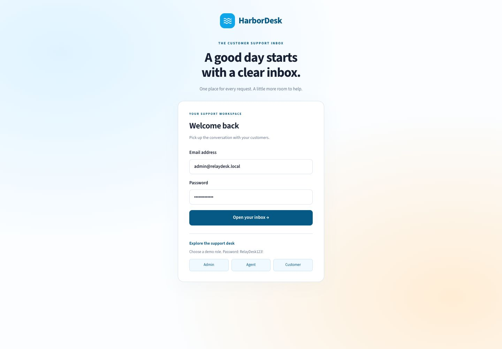
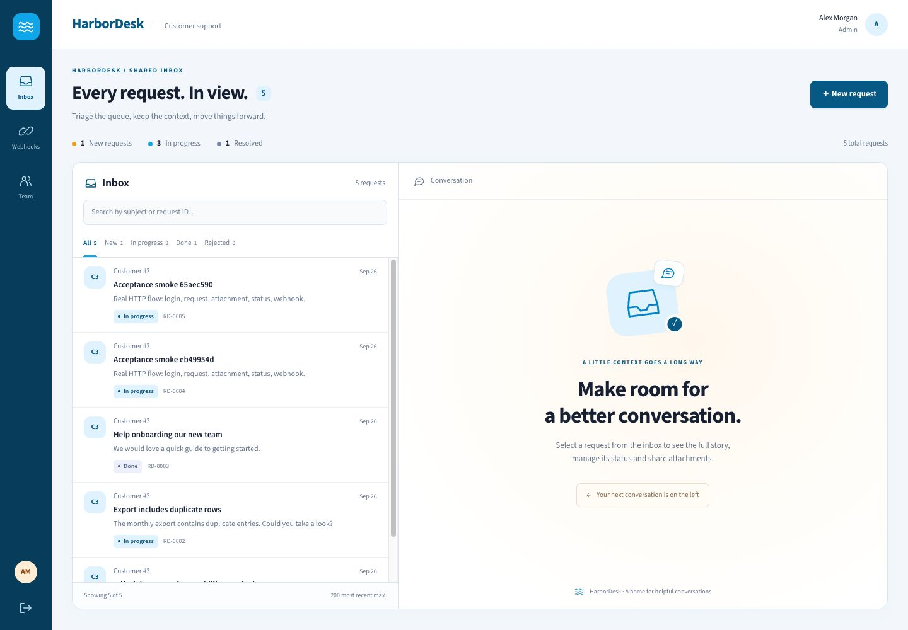
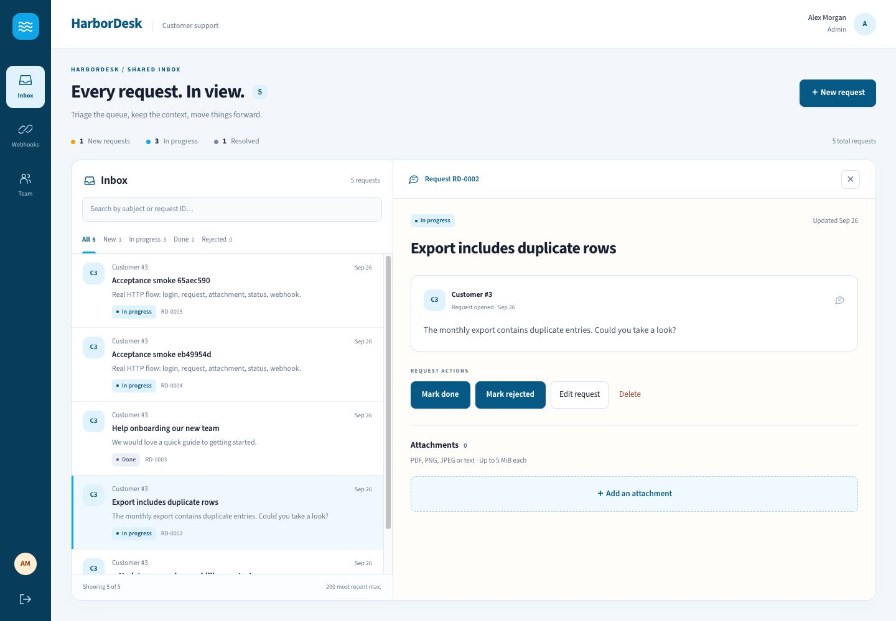
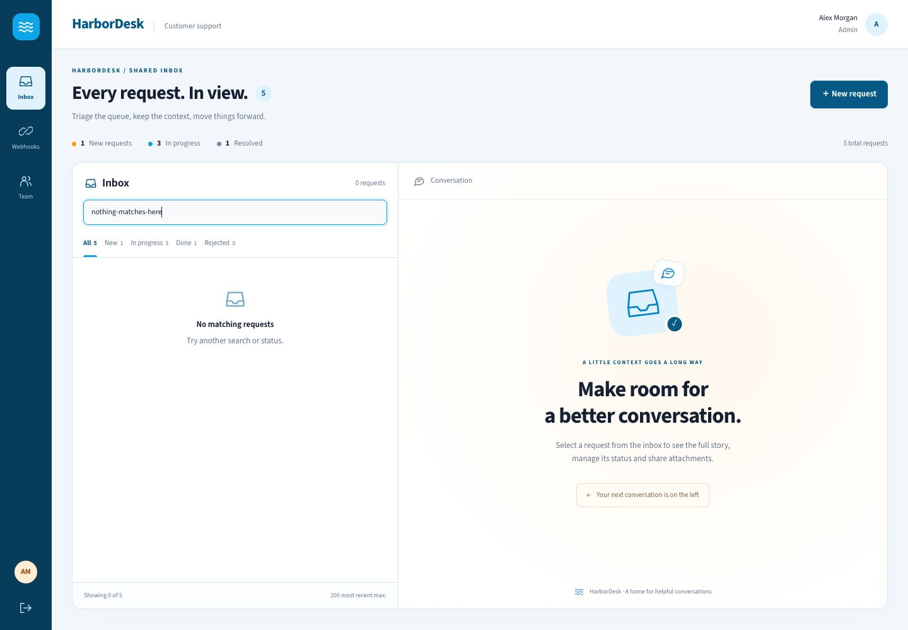
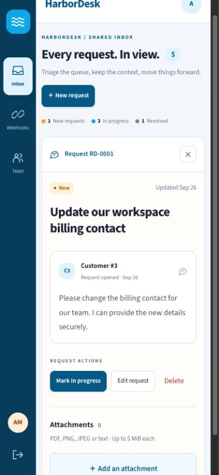
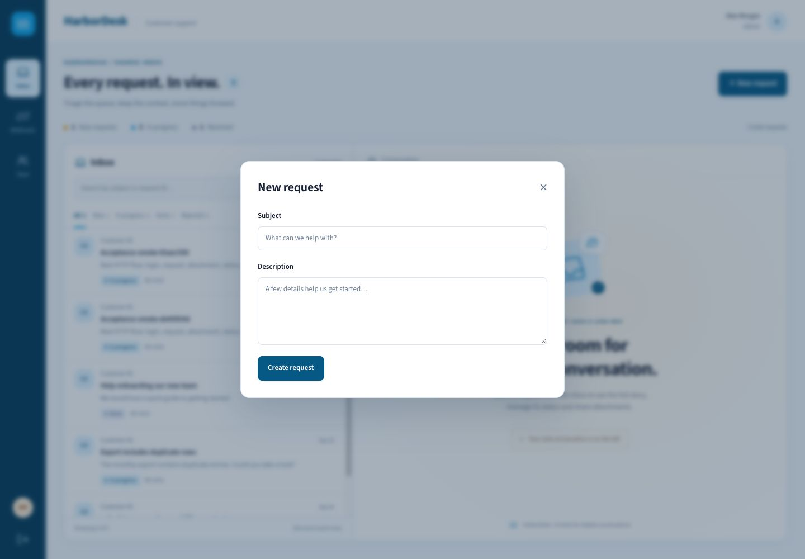

# HarborDesk visual pass

Gallery of the responsive support inbox pass, captured from the current source frontend at 1440×1000 and 390×844.

The pass is visual only: HarborDesk branding, sky/blue tokens, compact icon rail, master-detail inbox layout, conversation detail styling, and mobile overflow handling. Existing API contracts, request mutations, and critical-path behavior remain unchanged. The current request model does not expose true unread, SLA, priority, or reply fields, so the UI does not fabricate functional versions of those features.

Verification: `npm run typecheck`, `npm test`, and `npx next build --webpack` pass. Screenshots were checked at 1440×1000, 1024×768, and 390×844 with no horizontal overflow (the 1024px document scroll width measured 1009px). The default Turbopack build remains blocked by its sandbox child-process `Operation not permitted`; the webpack production build completed successfully.
